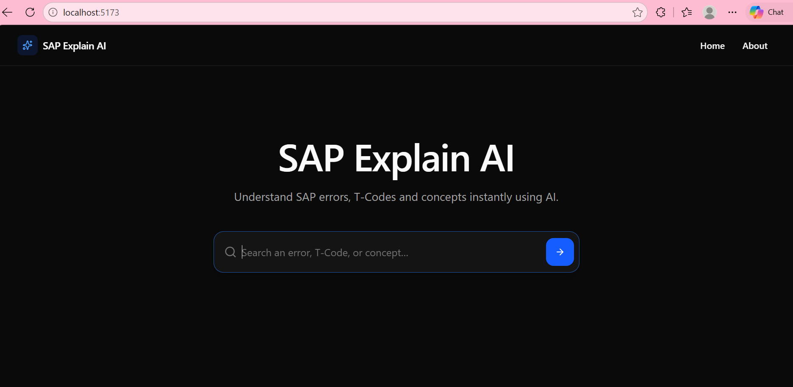
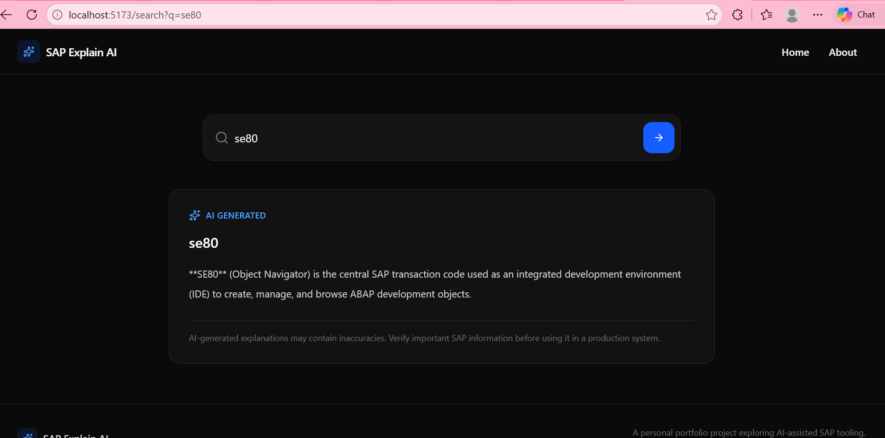
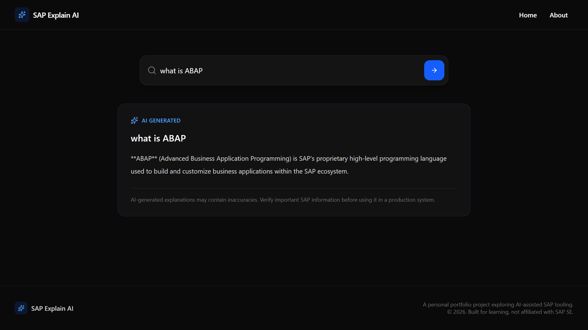
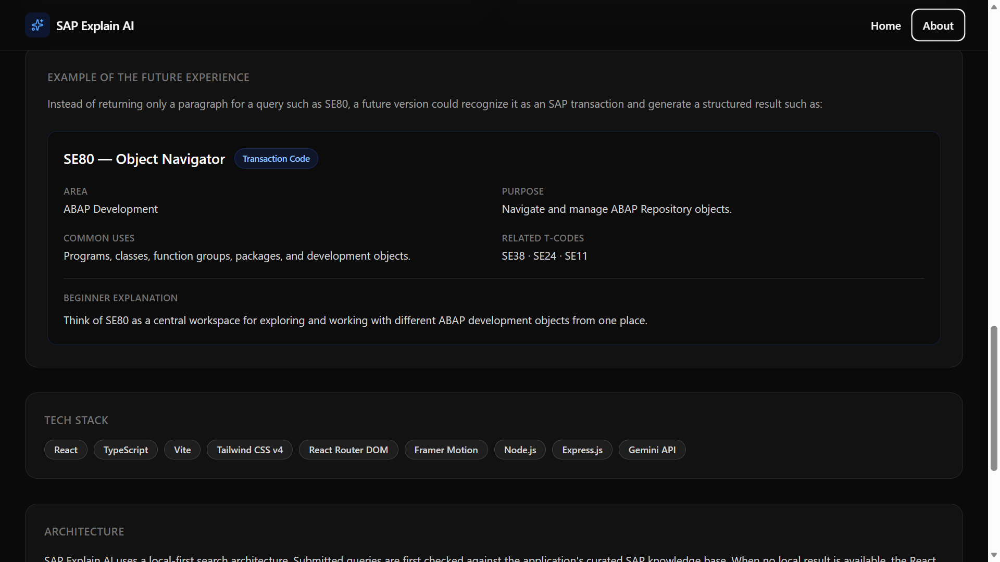

# SAP Explain AI

**SAP Explain AI** is an AI-assisted SAP knowledge explorer designed to make SAP technical concepts easier to search, understand, and navigate.

The application uses a **local-first search architecture**. Known SAP concepts are retrieved from a curated local knowledge base. When a submitted query is not available locally, the application securely sends it through a Node.js/Express backend to the **Gemini API** and displays an AI-generated explanation.

> **Note:** SAP Explain AI is an independent learning and portfolio project. It is not affiliated with SAP. AI-generated information should be verified before being used in a production SAP environment.

---

## Project Preview

### Home

The application provides a focused search interface for SAP errors, T-Codes, ABAP concepts, and other technical questions.



### AI-Powered SAP Explanations

When a query is not available in the local knowledge base, SAP Explain AI falls back to Gemini through the Express backend.



The AI fallback also supports natural-language SAP questions.



### Future Vision

The project is designed to evolve from general AI-generated explanations toward more structured and SAP-aware technical responses.



---

## Why SAP Explain AI?

General-purpose AI assistants and search engines can already answer many SAP-related questions. SAP Explain AI is not intended to replace them.

Instead, this project explores how general AI capabilities can be adapted into a **domain-focused technical assistant for the SAP ecosystem**.

Rather than sending every query directly to an AI model, SAP Explain AI first checks a curated local knowledge base. AI is used as a fallback when a local answer is unavailable.

This creates a hybrid approach:

```text
              User submits SAP query
                        |
                        v
              Local SAP Knowledge Base
                        |
                 +------+------+
                 |             |
              Found         Not Found
                 |             |
                 v             v
           Local Result   Express Backend
                               |
                               v
                           Gemini API
                               |
                               v
                       AI Explanation
```

This architecture allows the application to combine curated domain knowledge with the flexibility of generative AI instead of behaving only as a generic AI chat interface.

The long-term goal is to make the application increasingly aware of SAP terminology, development workflows, errors, transaction codes, ABAP concepts, and eventually authorized SAP system context.

---

## Current Features

The current version of SAP Explain AI includes:

- **Local-first SAP search** using a curated knowledge base
- **Gemini-powered AI fallback** when no local result is found
- Search support for:
  - SAP Transaction Codes
  - ABAP concepts
  - SAP technical terminology
  - Error-related questions
  - General SAP technical questions
- **Submit-only search behavior** to prevent unnecessary searches while typing
- Loading feedback while an AI response is being generated
- Error handling for failed AI requests
- Dedicated visual treatment for AI-generated answers
- Responsive user interface
- Client-side routing with a custom 404 page
- Server-side protection of the Gemini API key
- Clear distinction between curated local results and AI-generated content

---

## How It Works

When a user submits a search, SAP Explain AI first checks whether the query can be answered using its local SAP knowledge base.

If a matching result exists, it is displayed immediately.

If no matching local result exists, the frontend calls the application's backend API. The Express backend communicates with Gemini using a server-side API key and returns the generated explanation to the frontend.

```text
Search Query
     |
     v
React Frontend
     |
     v
Local Search Service
     |
 +---+---+
 |       |
Match   No Match
 |       |
 v       v
Local   POST /api/explain
Result       |
             v
       Express Backend
             |
             v
         Gemini API
             |
             v
      AI-generated Result
```

The Gemini API key remains on the server and is not exposed to frontend code.

---

## Tech Stack

### Frontend

- React
- TypeScript
- Vite
- Tailwind CSS v4
- React Router DOM
- Framer Motion
- Lucide React

### Backend

- Node.js
- Express.js
- TypeScript
- dotenv

### AI

- Google Gemini API
- Google GenAI SDK

### Development

- Git
- GitHub
- Visual Studio Code

---

## Project Architecture

The project separates UI components, search logic, local knowledge, backend communication, and AI integration into different layers.

```text
sap-explain-ai/
|
|-- docs/
|   `-- screenshots/
|       |-- home.png
|       |-- ai-se80-result.png
|       |-- ai-abap-result.png
|       `-- future-vision.png
|
|-- server/
|   `-- index.ts
|
|-- src/
|   |
|   |-- components/
|   |   |-- common/
|   |   |-- layout/
|   |   `-- search/
|   |
|   |-- data/
|   |   |-- features.ts
|   |   |-- knowledgeBase.ts
|   |   `-- popularSearches.ts
|   |
|   |-- hooks/
|   |   `-- useSearch.ts
|   |
|   |-- pages/
|   |   |-- About.tsx
|   |   |-- Home.tsx
|   |   |-- NotFound.tsx
|   |   `-- SearchResults.tsx
|   |
|   |-- services/
|   |   |-- aiService.ts
|   |   `-- searchService.ts
|   |
|   |-- styles/
|   |
|   |-- types/
|   |
|   `-- utils/
|
|-- .env
|-- .gitignore
|-- README.md
|-- package.json
|-- tsconfig.app.json
`-- vite.config.ts
```

### Key Responsibilities

**`knowledgeBase.ts`**

Contains curated local SAP knowledge used before the AI fallback.

**`searchService.ts`**

Handles searching the local knowledge base.

**`useSearch.ts`**

Manages search input and local search results.

**`aiService.ts`**

Handles communication between the React frontend and the backend AI endpoint.

**`server/index.ts`**

Runs the Express backend and securely communicates with Gemini.

**`SearchResults.tsx`**

Coordinates local results, AI fallback, loading states, errors, and result presentation.

---

## Example Searches

SAP Explain AI can be explored with searches such as:

```text
SE11
```

```text
SE80
```

```text
What is an ABAP internal table?
```

```text
What is SAP Basis?
```

Queries already available in the local knowledge base are answered locally.

Queries without a local match are passed to the AI fallback.

---

## Why Local-First?

Sending every query to an AI model is not always necessary.

SAP Explain AI therefore checks its curated knowledge base before making an AI request.

```text
Known Query
    |
    v
Local Answer
    |
    +-- No AI request required


Unknown Query
    |
    v
Express Backend
    |
    v
Gemini API
    |
    v
AI Explanation
```

This approach provides a foundation for maintaining curated answers for important SAP concepts while retaining the flexibility to answer questions outside the local dataset.

It also creates a clear architectural boundary between **domain knowledge maintained by the application** and **content generated dynamically by an AI model**.

---

## Future Vision

The current version establishes the core architecture:

```text
SAP Search + Local Knowledge + Backend + AI Fallback
```

The longer-term goal is to evolve SAP Explain AI from a search application into a more specialized **SAP technical assistant**.

### 1. Structured SAP Answers

Instead of returning the same generic paragraph format for every question, responses could be structured according to the type of SAP query.

For example, a future search for:

```text
SE80
```

could produce:

```text
SE80 — Object Navigator

Category:
Transaction Code

Area:
ABAP Development

Purpose:
Navigate and manage ABAP Repository objects.

Common Uses:
- Programs
- Classes
- Function groups
- Packages
- Development objects

Related T-Codes:
SE38 | SE24 | SE11

Beginner Explanation:
Think of SE80 as a central workspace for exploring
and working with different ABAP development objects.
```

---

### 2. Intelligent Query Classification

The application could automatically classify submitted queries into categories such as:

- Transaction Code
- ABAP concept
- SAP error
- Runtime dump
- Development object
- Configuration concept
- Troubleshooting question
- General SAP concept

The response format could then change according to the detected category.

For example:

```text
"SE80"
   |
   v
Transaction Code
   |
   v
T-Code-specific response structure
```

while:

```text
"What is an internal table?"
   |
   v
ABAP Concept
   |
   v
Concept-specific explanation
```

---

### 3. Guided SAP Error Troubleshooting

Instead of only explaining an SAP error, a future version could provide a structured troubleshooting flow:

```text
SAP Error
    |
    v
What does it mean?
    |
    v
Possible causes
    |
    v
What should I check?
    |
    v
Relevant SAP transactions
    |
    v
Suggested next steps
```

This could make the application more useful for technical investigation and learning.

---

### 4. ABAP Code Explanation

A future developer-focused mode could allow users to submit ABAP code and receive structured explanations covering:

- What the code does
- Important ABAP statements
- Relevant ABAP concepts
- Potential issues
- Readability suggestions
- Related SAP development objects

This would extend the project beyond SAP terminology search into ABAP development assistance.

---

### 5. Related SAP Knowledge

Results could automatically suggest related concepts and tools.

For example:

```text
                  SE80
                   |
        +----------+----------+
        |          |          |
       SE38       SE24       SE11
        |          |          |
    Programs     Classes    Dictionary
```

This could turn individual searches into guided SAP learning paths.

---

### 6. SAP OData Integration

Future versions could integrate with SAP OData services to retrieve authorized SAP data through defined service interfaces.

This would allow the project to move beyond static local knowledge and general AI-generated explanations.

---

### 7. SAP Gateway / SAP BTP Integration

SAP Gateway or SAP BTP could eventually provide a bridge between the application and SAP services.

A future architecture could evolve toward:

```text
                    SAP Explain AI
                          |
             +------------+------------+
             |                         |
             v                         v
     Curated Knowledge            AI Services
             |                         |
             +------------+------------+
                          |
                          v
                  SAP Integration Layer
                          |
                   +------+------+
                   |             |
                   v             v
              SAP OData       SAP BTP
                   |
                   v
           Authorized SAP Data
```

Any real-system integration would require appropriate authentication, authorization, and security controls.

---

### 8. Context-Aware SAP Assistance

With authorized SAP integration, a future version could potentially combine:

- Curated SAP knowledge
- AI-generated explanations
- Query classification
- Relevant system context
- Related transactions
- Troubleshooting guidance

This would move the project closer to a specialized technical assistant rather than a general-purpose question-answering interface.

---

## Security

The Gemini API key is stored using an environment variable:

```env
GEMINI_API_KEY=your_api_key_here
```

The `.env` file is excluded from Git through `.gitignore`.

The frontend does **not** communicate directly with Gemini.

Instead:

```text
Browser
   |
   v
React Frontend
   |
   v
Express Backend
   |
   v
Gemini API
```

This prevents the API key from being bundled into the client-side application.

> Never commit a real API key or `.env` file to GitHub.

---

## Running the Project Locally

### Prerequisites

Make sure the following are installed:

- Node.js
- npm
- Git

A Gemini API key is also required to use AI-generated explanations.

### 1. Clone the Repository

```bash
git clone https://github.com/InshaZeeshan/sap-explain-ai.git
```

Move into the project directory:

```bash
cd sap-explain-ai
```

### 2. Install Dependencies

```bash
npm install
```

### 3. Configure the Environment Variable

Create a `.env` file in the project root:

```env
GEMINI_API_KEY=your_gemini_api_key
```

Replace `your_gemini_api_key` with your own API key.

Do not commit this file.

### 4. Start the Backend

```bash
npx tsx server/index.ts
```

The backend runs locally on:

```text
http://localhost:3001
```

The health endpoint can be checked at:

```text
http://localhost:3001/api/health
```

A successful response should indicate that the SAP Explain AI backend is running.

### 5. Start the Frontend

Open another terminal and run:

```bash
npm run dev
```

Open the local URL displayed by Vite in your browser.

---

## Production Build

To verify that the frontend builds successfully for production:

```bash
npm run build
```

Vite generates the production frontend inside:

```text
dist/
```

---

## What This Project Demonstrates

SAP Explain AI was built as a portfolio and learning project demonstrating practical use of:

- React component architecture
- TypeScript
- React hooks and state management
- Client-side routing
- Responsive UI development
- Service-layer separation
- REST-style frontend/backend communication
- Node.js and Express
- Environment variables and secret management
- External AI API integration
- Asynchronous request handling
- Loading and error states
- Local-first fallback logic
- Git and GitHub workflow
- Domain-focused application design

It also explores a broader software-design question:

> How can a general-purpose AI model be placed behind a domain-specific application architecture instead of simply building another generic chatbot interface?

---

## Current Limitations

SAP Explain AI is currently a learning and portfolio project.

The current version:

- Does not connect to a live SAP system
- Does not retrieve production SAP data
- Does not perform SAP system changes
- Does not provide guaranteed troubleshooting or root-cause analysis
- Depends on AI-generated content when a local answer is unavailable
- Has a limited curated local knowledge base
- Requires verification of AI-generated technical information

These limitations are intentional and provide clear areas for future development.

---

## Project Status

**Current Stage:** Working Prototype

### Implemented

- Local SAP knowledge search
- React and TypeScript frontend
- Node.js/Express backend
- Gemini API integration
- Local-first AI fallback architecture
- Loading and error handling
- Responsive search interface
- Client-side routing
- Custom 404 page
- Server-side API key protection
- Project About/Future Vision page
- Git/GitHub version control

### Planned

- Structured SAP responses
- Intelligent query classification
- Expanded SAP knowledge base
- Guided SAP error troubleshooting
- ABAP code explanation
- Related SAP knowledge recommendations
- SAP OData integration
- SAP Gateway / SAP BTP exploration
- Context-aware SAP assistance

---

## Disclaimer

SAP Explain AI is an independent educational and portfolio project.

It is **not affiliated with, endorsed by, or sponsored by SAP**.

SAP and other SAP product names are trademarks or registered trademarks of their respective owners.

AI-generated explanations can be inaccurate or incomplete. Information produced by this application should be independently verified before being used for decisions or changes in a production SAP environment.

---

## Author

**Insha Zeeshan**

This project was built as a hands-on exploration of **SAP, full-stack web development, API integration, and generative AI**.

---

⭐ If you find the project interesting, consider starring the repository.